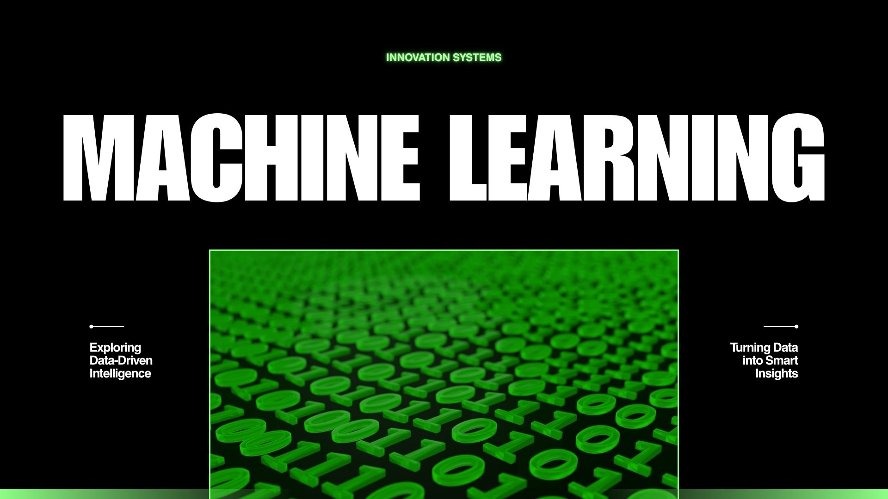

<table border="0">
  <tr>
    <td width="300" align="center">
      
        
      <h2 style="margin: 0; padding: 0; color: #333;">Abhijeet Patel</h2>
      
Aspiring AI/ML Engineer

    </td>
    <td valign="top" style="padding-left: 20px;">
      <h1 style="margin-top: 0; color: #111;">Hey! Nice to see you. 👋</h1>
      <h3 style="margin: 15px 0 5px 0; color: #222;">Hi, I'm Abhijeet Patel</h3>
      
I am passionate about <b>Machine Learning, MLOps, and End-to-End Deployment.</b>

      <ul style="color: #444; font-size: 1.05em; line-height: 1.6;">
        <li>🔭 Currently working on <b>Phishing Website Detection</b></li>
        <li>🌱 Learning more about <b>Deep Learning & Neural Networks</b></li>
        <li>⚡ Fun fact: I love solving complex technical problems!</li>
      </ul>
    </td>
  </tr>
</table>

  

---
<table border="0">
  <tr>
    <td width="300" align="center">
      
       
      <h3>Abhijeet Patel</h3>
      
Aspiring AI/ML Engineer

    </td>
    <td valign="top">
      <h1>Hey! Nice to see you. 👋</h1>
      <h3>Hi, I'm Abhijeet Patel</h3>
      
I am passionate about <b>Machine Learning, MLOps, and End-to-End Deployment.</b>

      <ul>
        <li>🔭 Currently working on <b>Phishing Website Detection</b></li>
        <li>🌱 Learning more about <b>Deep Learning & Neural Networks</b></li>
        <li>⚡ Fun fact: I love solving complex technical problems!</li>
      </ul>
    </td>
  </tr>
</table>

  

---

  

<h1 align="center">Hi 👋, I'm Abhijeet Patel</h1>
<h3 align="center">Aspiring Python & ML Engineer from India 🇮🇳</h3>

  

### 🚀 About Me

- 🔭 **Current Focus:** Building an end-to-end **Phishing Website Detection System** using Machine Learning.  
  👉 [Live Demo](https://abhijeet-ml-07-phishing-website-detection.hf.space)

- 🌱 **Learning Path:** Mastering **Python**, **Deep Learning**, and **MLOps** (Docker & Cloud Deployment).

- 👯 **Featured Project:** Collaborating on the **Income Classifier Project** to predict socio-economic brackets.  
  👉 [Live Demo](https://huggingface.co/spaces/abhijeet-ml-07/income-classifier-project)

- 👨‍💻 **Portfolio:** Explore all my technical work at [github.com/Abhijeetggits](https://github.com/Abhijeetggits)

- 💬 **Ask Me About:** Python, ML Pipelines, FastAPI, SQL, and Scikit-learn.

- 📫 **Contact:** Reach out via [abhijeetpatel176@gmail.com](mailto:abhijeetpatel176@gmail.com)

---

### 🛠️ Languages & Tools

  

  
  
  
  
  

---

### 📊 GitHub Statistics

  
  

  

---

### 🔗 Connect with Me

